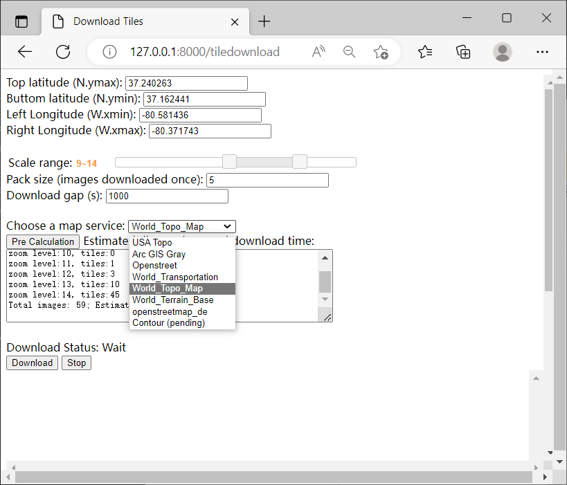
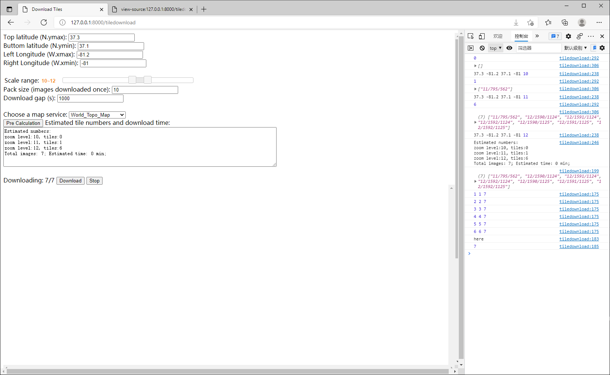

# Offline version notes (07/2021)
Entrance: (Taskgeneration.html) http://127.0.0.1:8000/
1. arcgis api download and put in static folder
2. setup arcgis javascript. modify file: 4.19\init.js [HOSTNAME_AND_PATH_TO_JSAPI] to baseUrl:"/static/arcgis_js_api/4.19/dojo"
3. layers: gray, topo, contour(pending),  
4. download offline tiles when having internet  http://127.0.0.1:8000/demo
5. set rect, zoom in file getContourTiles.html function getImageFromMapServerRestAPI
6. more user interface are needed for downloading maps, but for now, it's ok.
7. 3 map resources are avaliable, topo is the best, gray map is the based, contour map need debugging. If more map tile servers could be found, just change the url.
8. copy downloaded map to  static/maptile/org, then use supportedfiles/TileImagestoFolder.py to establish to osm folders
8. alternative option: use "Global mapper 30 days free" to download


# Tile Download Module (07/2022)
Entrance:(tileDownload.html) http://127.0.0.1:8000/tiledownload
1. Need internet to download image to server folder: /static/maptile/map_service_name
2. Enter the boundary, scale range (the larger, the more detailed), choose a map service
3. Click "Pre Calculation" to estimate download time
4. Click "Download"
5. The number of downloaed images are shwon: "Downloaded current_downloaded/total_tiles"

Notes: If adding new tile layers to the downloading in html, please aware the x and y is different among different tile service.

# SAR Web User Interface Demo


[more examples](screen/)

## Built based on
- DJango as sever
- ESRI js development platform,
- d3 for polygon and voronoi.
- SQLite as database
- DJango REST freamwork is needed

-----------2019 06 12-------------

If the migration sends errors, try:
- delete all tables in the db.sqlite3
- delete the migration folders
- manage.py makemigrations users
- manage.py migrate users

- manage.py makemigrations
- manage.py migrate

- manage.py makemigrations app3
- manage.py migrate app3

- manage.py createsuperuser
Enter username
Enter password
The username and password will be used to post/update gpsdatas.

New:
- Home page for sign up : http://127.0.0.1:8000
- admin page for user management:  http://127.0.0.1:8000/admin

-----------2019 05 17 ------------
1. Setup
[Django REST framework](https://www.django-rest-framework.org/tutorial/quickstart/)

pip install djangorestframework

In settings:

INSTALLED_APPS = [
    ...
    'rest_framework',
    ...
]

2. Stream GPS data to database:

Step 1) Post a new device

Step 2) Update GPS data

Code in python:  
```python
import requests

# create a new device, deviceis is the primary key
r = requests.post('http://127.0.0.1:8000/app3/gpsdatas/',auth=('username','password'), data = {'deviceid':'max_testing', 'taskid':'sar_put2','gpsdata':'{"gps":["stamp":004,"lat":-81,"log":37]}'})

# update record based on primary key. For example: "./max_testing/" is added as pk
r = requests.patch('http://127.0.0.1:8000/app3/gpsdatas/max_testing/', auth=('username','password'), data = {'deviceid':'max_testing', 'taskid':'sar_put2','gpsdata':'{"gps":["stamp":004,"lat":-80,"log":38]}'})
```

3. Operate in browser:
Open the link in chrome: http://127.0.0.1:8000/app3/gpsdatas/


-------------------------------
# Tile Download Module (07/2021)
Entrance:(tileDownload.html) http://127.0.0.1:8000/tiledownload
1. Need internet to download image to local default download folder: ‪/Users/username/Downloads
2. Copy all the files to server folder sarweboffline/static/maptile/org
3. run supportedfiles/TileImagestoFolder.py
4. put the files to layer folder
5. modify layers in Taskgeneration.html: be aware that the {row}{col} are different among different services
6. if adding new tile layers to the downloading, please aware the x and y is different among different tile servers
7. test it and enjoy:)

Notes: the tileDownload.html code code run on any online html sandbox. All u need is to copy the code and run. Then use TileImagestoFolder.py to structure the images to layerfolders.


